최종 프로젝트 (영화 페이지 구현)


**구성원**

- 광주_1반 정석호
- 광주_1반 노은영


**언어**

1. django
2. vue.js 2.X
3. Node 16.X


**Modeling**

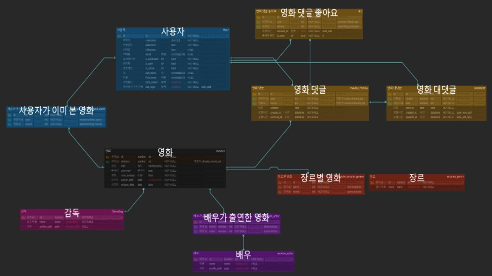  


**컴포넌트 구조**

- User

  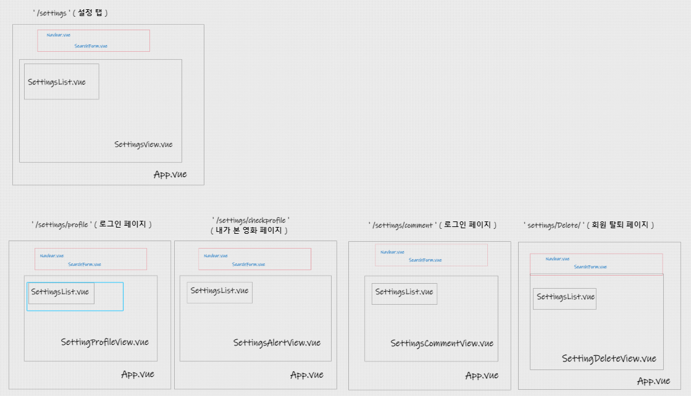  


- Movie

  ​     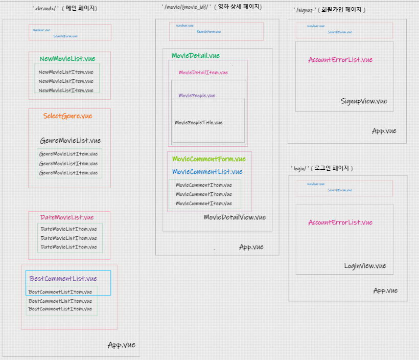  

  

**router**

|         Path         |      Component      |             Description             |
| :------------------: | :-----------------: | :---------------------------------: |
|         /404         |     NotFound404     |         잘못된 경로 페이지          |
|          /           |    MainPageView     |             메인 페이지             |
|   /movies/:movieId   |   MovieDetailView   |         영화 디테일 페이지          |
|  /settings/profile   | SettingsProfileView | 유저 프로필 및 개인정보 수정 페이지 |
|  /settings/profile   |  ProfileUpdateView  |         프로필 수정 페이지          |
|  /settings/profile   | changePasswordView  |        비밀번호 변경 페이지         |
| /settings/checkmovie |  SettingsCheckView  |         내가 본 영화 페이지         |
|  /settings/articles  |    articlesView     |     유저가 작성한 게시글 페이지     |
|        /login        |      LoginView      |            로그인 페이지            |
|       /signup        |     SignupView      |           회원가입 페이지           |


**Views & Components**

**\-	HomeView.vue**

​	**TheNavbar.vue**

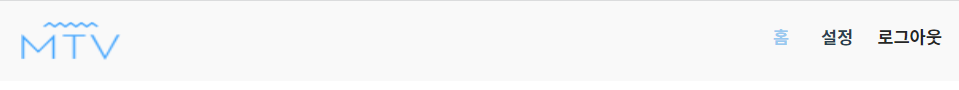


​	**NewMovieList.vue**


​	**DateMovie.vue**

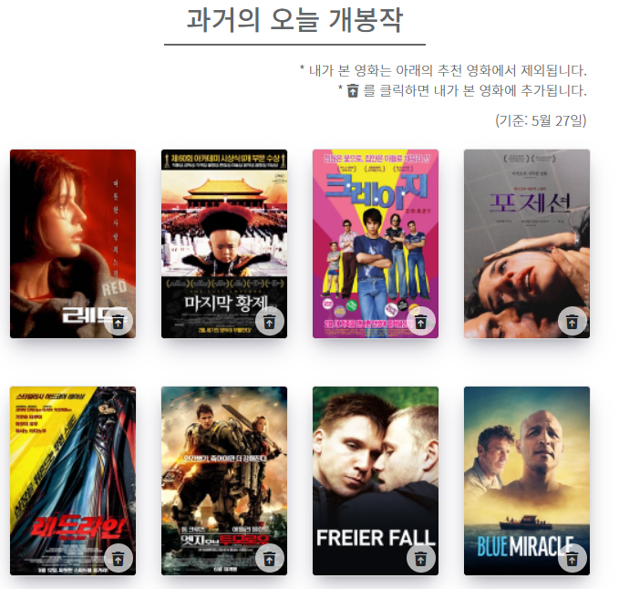


​	**SelectGenre.vue**

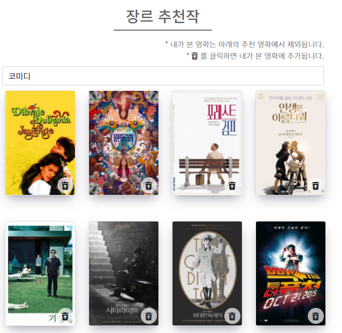


​	**BestReview.vue**

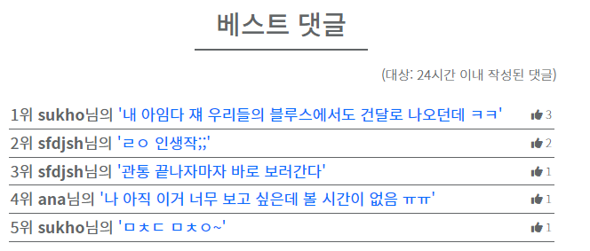


\-	**SettingsView.vue**

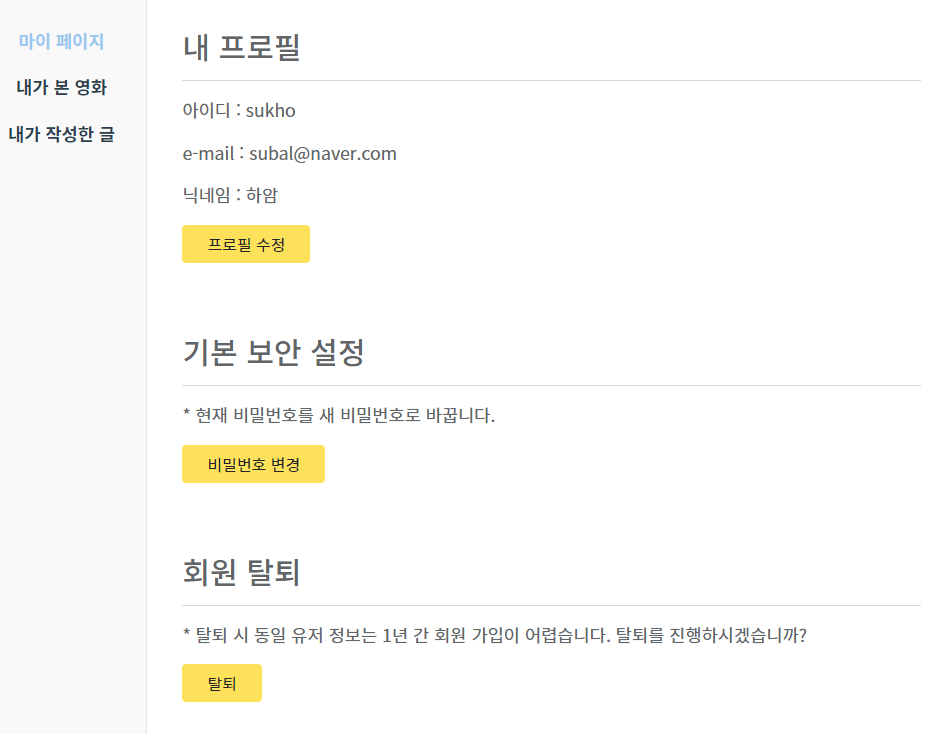


​	**SettingsProfileView.vue**

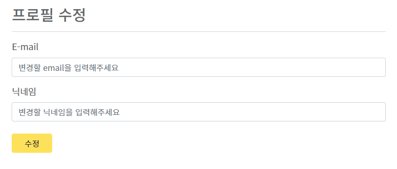

​	**SettingsCheckVIew.vue**


​	**changePasswordView.vue**

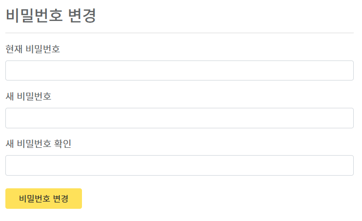

​	**articlesView.vue**

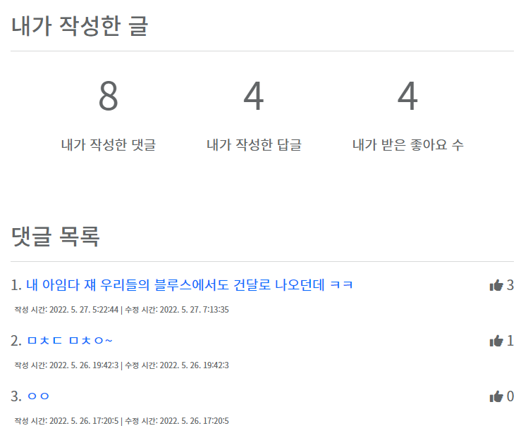


\-	**MovieDetail.vue**

​	**MovieDetailItem.vue**

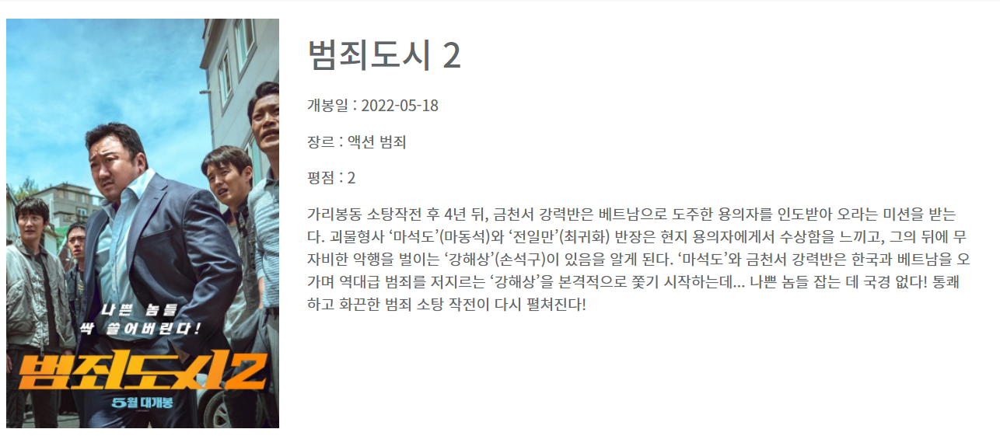


​	**MovieDetailPeople**

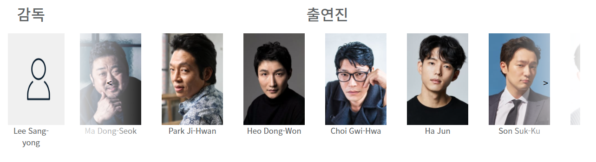

​	**MovieDetailTitle.vue**


​	**ReviewComment.vue**

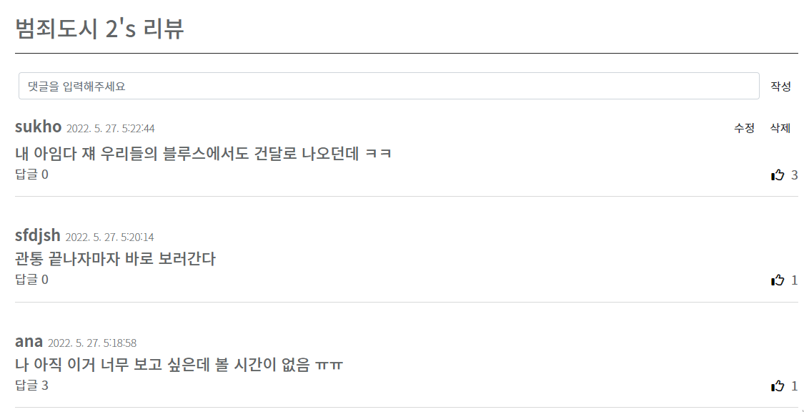


**스케줄**

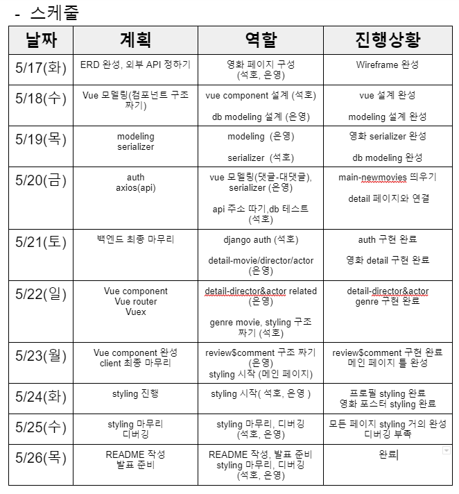


**기본 로직**

```
- movie
  django에서 axios를 통해 TMDB의 영화 데이터의 정보를 가져오고 Vue에서 CORS를 통해 django의 데이터를 가져왔다.

- User
  django에서 all-auth, rest-auth 패키지를 사용해 유저 관리를 Token으로 관리하였고 Vue에서 django에서 가지고 있는 Token을 받아왔다. 
```


**issue**

```
- git 오류

폴더 안에 있는 폴더 이름을 변경해서 서버가 잘 켜지지 않았다. 폴더명이 바뀌면서 django와 vue에서 혼동이 와 에러가 난 것 같다. 또한 2명이 같은 곳을 작업할 경우 충돌이 일어날 경우가 있기 때문에 git branch 를 이용해 프로젝트를 진행하였다.

- dump data

django에서 dumpdata를 만들어 프로젝트 django에서 load할려고 했지만 dumpdata를 하는 과정에서 인코딩 문제가 생겼다. 그래서 $ python -Xutf8  manage.py dumpdata movies.Genre --indent 4 > genres.json를 써 dumpdat를 만들었다.

- 영화와 감독 & 배우 관계 

감독과 배우 데이터가 따로 있는 게 아니고 영화 데이터에 있는 감독과 배우의 데이터여서 1:N인지 M:N인지 헷갈렸다. 영화 데이터를 저장할 때 감독 데이터가 1:n이여서 감독 인스턴스를 영화 인스턴스 생성시 같이 인자로 넘겨줘야해서 그 부분을 캐치해내기까지 오래걸렸던 거 같다. 영화의 줄거리 부분이 빈 데이터는 db에 담지 않으려고 했는데, 그걸 맨 처음에 확인했어야 했는데 순서가 중요하다는 걸 캐치하지 못해서 감독 데이터 db에 담고나서 영화 줄거리를 필터하다보니까..감독과 영화의 갯수가 매치하지 않는 문제가 있었다.

감독과 배우 관련 영화를 서버에게 요청보내는 데 오류도 많이 나고 204를 썻더니 에러는 아닌데 res.data가 찍히지 않았다. 감독은 1:N이고 배우는 M:N이여서 내부 로직이 조금 달라야했다.

감독:Movie.objects.filter(director=director).exclude(pk=movie_id)
배우: actor.movies.all().exclude(pk=movie_id)

- SITE_ID

vue에서 회원을 관리하는 쪽에서 에러가 계속 났다. 알고 보니 SITE_ID=1 을 django의 settings.py 에 넣어주지 않았다.
* SITE_ID 정수값은 django_site 데이터베이스 테이블에 있는 현재 사이트의 값이다. django_site 테이블에 여러 개의 사이트를 등록하고 그 중 하나를 지정하는 역할을 한다.

- auth

회원가입을 할 때 dj_rest_auth.registration.urls로 nickname을 추가하여 데이터를 만들려고 했으나 해당 패키지는 username과 password 값만 저장할 수 있어서 처음 회원가입 때는 아이디와 비밀번호만 적게 해주고 프로필 수정 탭에서 닉네임과 email를 추가해주는 식으로 진행했다.

```

